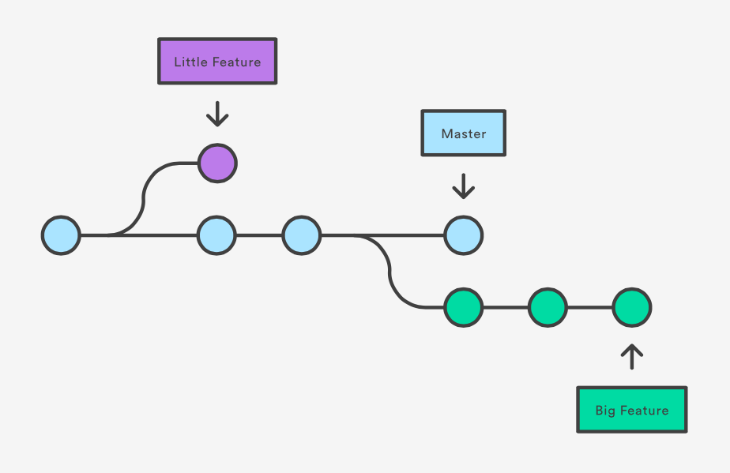

<<<<<<< HEAD
# Инструкция для работы с Markdown

## Выделение текста

* Чтобы выделить текст курсивом - необходимо обрамить его звездочками (*) или знаком нижнего подчеркивания (_). Например, *вот так* или _вот так_.

* Чтобы выделить текст полужирным - необходимо обрамить его двойными звездочками (**) или двойным знаком нижнего подчеркивания (__). Например, **вот так** или __вот так__.

* Альтернативные способы выделения текста курсивом или полужирным нужны для того, чтобы мы могли совмещать оба этих способа. Например, _текст может быть выделен курсивом и при этом быть **полужирным**_.

## Работа с изображениями

Чтобы вставить изображение в текст - достаточно написать следующее:

## Списки

Чтобы добавить ненумерованный список - необходимо выделить пункты звездочкой (*) или знаком (+). Например, вот так:
* Элемент 1;
* Элемент 2;
* Элемент 3;
+ Элемент 4.

Чтобы добавить нумерованный список - необходимо пронумеровать пункты. Например, вот так:
1. Первый пункт.
2. Второй пункт.
## Ссылки

## Работа с таблицами

## Цитаты

## Заключение
=======
# **Markdown** - язык разметки!
## *Синтаксис языка Markdown:*
1. Большой заголовок - "#" с пробелом в начале слова.
2. Подзаголовок - "##" с пробелом в начале слова.
3. КурсОР - "*" в начале и в конце слова.
4. Полужирный - "**" в начале и в конце слова.
5. Список:
    * ненумерованный - "*" с пробелом в начале слова.
    * нумерованный - "1." с пробелом в начале слова.
    
>>>>>>> NewBranch
